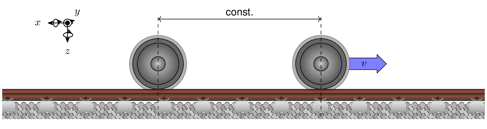

<picture>
  <source srcset="docs/source/images/logo_rolland_light.svg" media="(prefers-color-scheme: light)">
  
</picture>

[](https://github.com/mantelmax/rolland)
[](https://rolland-rolling-noise-and-dynamics.readthedocs.io/en/latest/?badge=latest)
[](https://www.python.org/)
[](https://doi.org/10.5281/zenodo.21920225)

# Rolland

Rolling Noise and Dynamics (**Rolland**) is an open-source, high-performance time-domain simulation framework designed to analyze, predict, and optimize the dynamic and acoustic properties of railway tracks.

By employing an explicit Finite Difference Method (FDM) scheme, **Rolland** solves 13 differential equations of motion alongside 14 additional auxiliary differential equations corresponding to the boundary domain. This captures full track dynamics—including coupled vertical and lateral bending, longitudinal waves, axial torsion, cross-sectional warping, and sleeper movement under eccentric excitation and support conditions. The framework incorporates Complex Frequency-Shifted Perfectly Matched Layers (CFS-PML) for infinite track modeling and supports spatially varying track properties as well as moving excitation sources.

# Key Features

- **Full Track Dynamics:** Solves 13 differential equations of motion alongside 14 additional auxiliary differential equations to capture vertical and lateral bending waves, longitudinal waves, torsional waves, and warping effects together with sleeper movement and eccentric support reactions.
- **Fast Time-Domain Solver:** Uses explicit Finite Difference Method (FDM) schemes with high-order stencils for fast simulations.
- **Infinite Track Boundary (CFS-PML):** Uses absorbing boundary layers to eliminate artificial wave reflections.
- **Flexible Track Structures:** Supports ballasted and slab tracks with continuous or discrete supports, including spatial (periodic/stochastic) track property variations.
- **Excitation:** Includes stationary excitation (Gaussian impulse) and moving sources (e.g. moving random force).
- **Post-Processing & Validation:** Computes point/transfer mobility, Track Decay Rate (TDR), and provides built-in reference models for easy validation.

**Planned Features:**

- Non-linear Hertzian contact dynamics for wheel-rail interaction.
- Multi-wheel vehicle pass-by excitation models.
- Rail acoustic radiation modeling.

<picture>
  <source srcset="docs/source/images/mwi_animated_github_dark.gif" media="(prefers-color-scheme: dark)">
  
</picture>

# Installation

To install **Rolland**, run:

```bash
pip install rolland
```

# Documentation

Documentation is available [here](https://rolland-rolling-noise-and-dynamics.readthedocs.io) with how-to guides and detailed API reference.

# Contributing

Contributions to **Rolland** are welcome! Whether you are reporting bugs, improving documentation, or submitting pull requests for new features:

1. Fork the repository on GitHub.
2. Create a feature branch (`git checkout -b feature/amazing-feature`).
3. Ensure code formatting meets requirements using `ruff check` and tests pass with `pytest`.
4. Submit a Pull Request with a clear summary of your changes.

# License

This project is licensed under the **BSD 3-Clause License**. See the `pyproject.toml` file for licensing metadata.

# Citation

If you use **Rolland** for academic work, please consider citing both our publication:

> Mantel, M., & Sarradj, E. (2026). Time-domain modeling of coupled wave propagation in discretely supported railway tracks. *Computers & Structures* (Accepted for publication on August 12, 2026).

```bibtex
@article{mantel2026timedomain,
  title   = {Time-domain modeling of coupled wave propagation in discretely supported railway tracks},
  author  = {Mantel, Maximilian and Sarradj, Ennes},
  journal = {Computers \& Structures},
  year    = {2026},
  note    = {Accepted for publication on August 12, 2026},
  doi     = {}
}
```

and our software:

> Mantel, M., Wagner, B., & Sarradj, E. (2026). Rolland: A Time-Domain Simulation Framework for Railway Track Dynamics and Rolling Noise. https://doi.org/10.5281/zenodo.21920225

```bibtex
@software{mantel2026rolland_api,
  title  = {Rolland: A Time-Domain Simulation Framework for Railway Track Dynamics and Rolling Noise},
  author = {Mantel, Maximilian and Wagner, Benjamin and Sarradj, Ennes},
  year   = {2026},
  url    = {https://github.com/mantelmax/rolland},
  doi    = {10.5281/zenodo.21920225}
}
```
