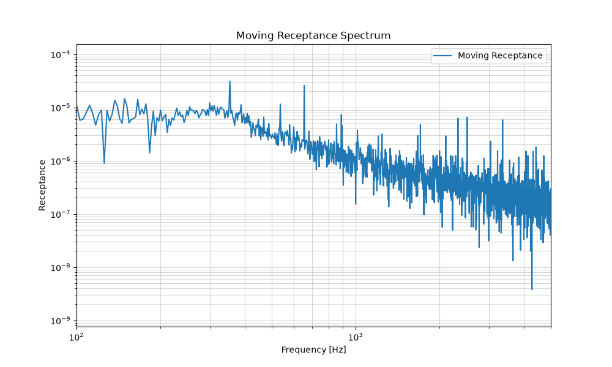

.. _moving_random_force:

Moving Random Force Excitation
==============================
This example demonstrates how to set up a simulation with a moving random force excitation across a periodic ballasted track
and evaluate the moving receptance spectrum using the Rolland library.

.. note:: To avoid initial transient effects from the moving excitation startup, a portion of the initial time series (e.g. 30%) is skipped during postprocessing.

.. code-block:: python
  :caption: Python Code
  :linenos:

    """
    Moving Random Force Simulation using Rolland API

    This example demonstrates how to:
        1. Define a periodic ballasted single rail track
        2. Set up a moving random force excitation (RandomForce)
        3. Run time-domain deflection simulation
        4. Calculate and plot the moving receptance
    """

    from matplotlib import pyplot as plt
    from rolland import DiscrPad, Sleeper, Ballast
    from rolland.database.rail.db_rail import UIC60
    from rolland import SimplePeriodicBallastedSingleRailTrack
    from rolland import CFSPML
    from rolland.excitation import RandomForce
    from rolland import Deflection
    from rolland import DomSetup
    from rolland.postprocessing import TrackResponse

    # 1. TRACK DEFINITION ----------------------------------------------------------
    track = SimplePeriodicBallastedSingleRailTrack(
        rail=UIC60,
        pad=DiscrPad(
            sp_z=120e6, sp_y=40e6, sp_x=40e6,
            etap_z=0.2, etap_y=0.2, etap_x=0.2, etap_r=0.2, wdthp=0.15
        ),
        sleeper=Sleeper(
            ms=300.05, rhos=2648, Is_x=0.0593, Is_y=0.00089, Is_z=0.0596,
            lengs=2.5, wdths=0.245, heights=0.185, z_st=-0.0925, z_sb=0.0925
        ),
        ballast=Ballast(
            sb_z=120e6, sb_y=120e6, sb_x=120e6,
            etab_z=1.0, etab_y=2.0, etab_x=2.0, etab_r=2.0
        ),
        z_f=81e-3,
        y_f=0,
        num_mount=100,
    )

    # 2. BOUNDARY & MOVING EXCITATION ---------------------------------------------
    bound = CFSPML()

    # Moving random force excitation with speed v = 60 m/s
    exc = RandomForce(
        v=60.0,
        F_stat_z=65e3,
        F_stat_y=5e3,
        z_e=-71e-3,
        y_e=0,
    )

    # 3. DISCRETIZATION & SIMULATION ----------------------------------------------
    discr = DomSetup(
        track=track,
        bound=bound,
        req_simt=0.5,
    )

    defl = Deflection(
        discr=discr,
        excit=exc,
        store="excit",
    )

    # 4. POSTPROCESSING & VISUALIZATION -------------------------------------------
    # 4.1 Remove transient phase from simulation arrays
    # Skip initial 30% of time steps to exclude transient effects
    skip = int(0.3 * discr.nt)
    defl.u_z_obs = defl.u_z_obs[skip:]
    exc.force_z = exc.force_z[skip:]

    # 4.2 Process frequency response and display results
    response = TrackResponse(result=defl)
    response.show(quantity='receptance', label="Moving Receptance")
    plt.title("Moving Receptance Spectrum")
    plt.show()

