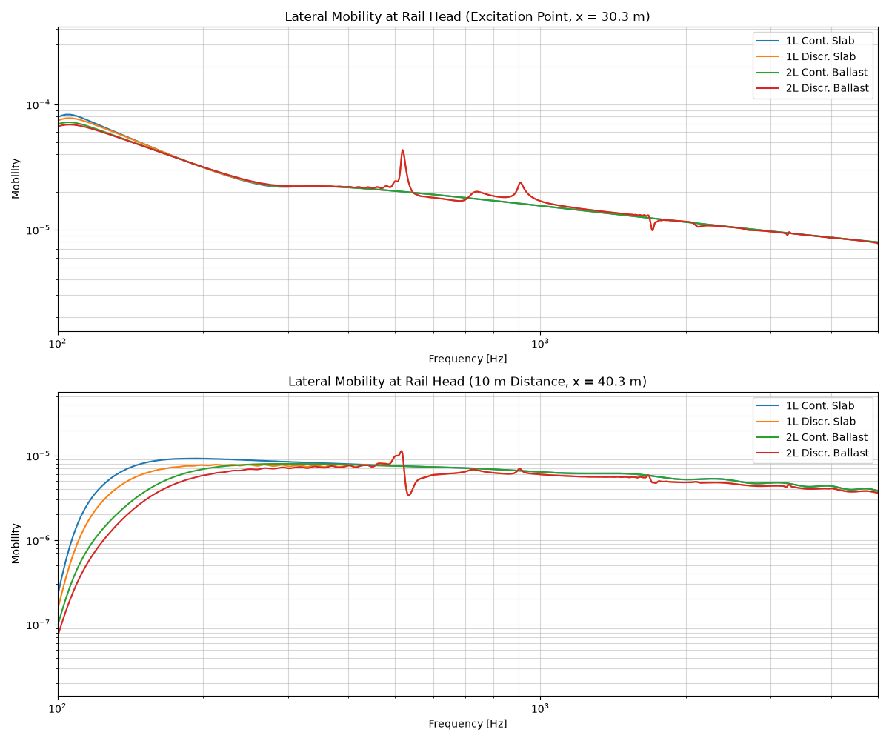

.. _different_tracks_lateral:

Compare Different Tracks (Lateral Excitation)
==============================================
This example demonstrates how to calculate and compare the lateral frequency response of different railway tracks
at the rail head under a lateral Gaussian impulse excitation.

.. code-block:: python
  :caption: Python Code
  :linenos:

    """
    Comparative Track Vibration Analysis (Lateral Excitation) using Rolland API

    This example demonstrates a comparison of lateral vibration characteristics for:
        1. Continuous slab track (1-layer cont.)
        2. Discrete slab track (1-layer discr.)
        3. Continuous ballasted track (2-layer cont.)
        4. Discrete ballasted track (2-layer discr.)
    """

    from matplotlib import pyplot as plt
    from rolland import DiscrPad, Sleeper, Ballast, ContPad, Slab
    from rolland.database.rail.db_rail import UIC60
    from rolland.track import (
        ContSlabSingleRailTrack,
        ContBallastedSingleRailTrack,
        SimplePeriodicSlabSingleRailTrack,
        SimplePeriodicBallastedSingleRailTrack,
    )
    from rolland.boundary import CFSPML
    from rolland.excitation import GaussianImpulse
    from rolland.deflection import Deflection
    from rolland.domainsetup import DomSetup
    from rolland.postprocessing import PointResponse

    # 1. PARAMETERS DEFINITION -----------------------------------------------------
    slep_dist = 0.6
    rail = UIC60

    contpad = ContPad(
        sp_z=120e6 / slep_dist,
        sp_y=40e6 / slep_dist,
        sp_x=40e6 / slep_dist,
        etap_z=0.2,
        etap_y=0.2,
        etap_x=0.2,
        etap_r=0.2,
        wdthp=0.15,
    )

    discrpad = DiscrPad(
        sp_z=120e6,
        sp_y=40e6,
        sp_x=40e6,
        etap_z=0.2,
        etap_y=0.2,
        etap_x=0.2,
        etap_r=0.2,
        wdthp=0.15,
    )

    sleeper = Sleeper(
        ms=300.05,
        rhos=2648,
        Is_x=0.0593,
        Is_y=0.00089,
        Is_z=0.0596,
        lengs=2.5,
        wdths=0.245,
        heights=0.185,
        z_st=-0.0925,
        z_sb=0.0925,
    )

    slab = Slab(
        ms=300.05 / slep_dist,
        Is_x=0.0593 / slep_dist,
        Is_y=0.00089 / slep_dist,
        Is_z=0.0596 / slep_dist,
        lengs=2.5,
        rhos=2648,
        equ_wdths=0.245,
        heights=0.185,
        z_st=-0.0925,
        z_sb=0.0925,
    )

    contballast = Ballast(
        sb_z=120e6 / slep_dist,
        sb_y=120e6 / slep_dist,
        sb_x=120e6 / slep_dist,
        etab_z=1.0,
        etab_y=2.0,
        etab_x=2.0,
        etab_r=2.0,
    )

    discrballast = Ballast(
        sb_z=120e6,
        sb_y=120e6,
        sb_x=120e6,
        etab_z=1.0,
        etab_y=2.0,
        etab_x=2.0,
        etab_r=2.0,
    )

    # 2. TRACK DEFINITIONS ---------------------------------------------------------
    # 2.1 Continuous slab track
    track_1l_cont = ContSlabSingleRailTrack(
        rail=rail, pad=contpad, l_track=60, z_f=81e-3, y_f=0
    )

    # 2.2 Discrete slab track
    track_1l_discr = SimplePeriodicSlabSingleRailTrack(
        rail=rail, pad=discrpad, z_f=81e-3, y_f=0, num_mount=100
    )

    # 2.3 Continuous ballasted track
    track_2l_cont = ContBallastedSingleRailTrack(
        rail=rail, slab=slab, ballast=contballast, pad=contpad, l_track=60, z_f=81e-3, y_f=0
    )

    # 2.4 Discrete ballasted track
    track_2l_discr = SimplePeriodicBallastedSingleRailTrack(
        rail=rail, pad=discrpad, sleeper=sleeper, ballast=discrballast, z_f=81e-3, y_f=0, num_mount=100
    )

    # 3. BOUNDARY & LATERAL EXCITATION --------------------------------------------
    bound = CFSPML()
    exc_lat = GaussianImpulse(x_excit=30.3, force_dir="lateral", z_e=-71e-3)

    # 4. SIMULATION & POSTPROCESSING -----------------------------------------------
    tracks = [
        ("1L Cont. Slab", track_1l_cont),
        ("1L Discr. Slab", track_1l_discr),
        ("2L Cont. Ballast", track_2l_cont),
        ("2L Discr. Ballast", track_2l_discr),
    ]

    plt.figure(figsize=(12, 10))

    # Plot 1: Response at excitation point
    plt.subplot(2, 1, 1)
    for label, trk in tracks:
        discr = DomSetup(track=trk, bound=bound, req_simt=0.5)
        defl = Deflection(discr=discr, excit=exc_lat, store="excit")
        freq, mob_y = PointResponse.calc_coupled_mobility(
            defl.u_y_obs, defl.phi_x_obs, exc_lat.z_e, exc_lat.force, discr
        )
        plt.loglog(freq[:discr.nt // 2], abs(mob_y[:discr.nt // 2]), label=label)

    plt.xlabel("Frequency [Hz]")
    plt.ylabel("Mobility [m/sN]")
    plt.title("Lateral Mobility at Rail Head (Excitation Point, x = 30.3 m)")
    plt.xlim(50, 6000)
    plt.grid(True, which="both")
    plt.legend()

    # Plot 2: Response at 10 m distance
    plt.subplot(2, 1, 2)
    for label, trk in tracks:
        discr = DomSetup(track=trk, bound=bound, req_simt=0.5)
        defl = Deflection(discr=discr, excit=exc_lat, store="observe", obs_pos=40.3)
        freq, mob_y = PointResponse.calc_coupled_mobility(
            defl.u_y_obs, defl.phi_x_obs, exc_lat.z_e, exc_lat.force, discr
        )
        plt.loglog(freq[:discr.nt // 2], abs(mob_y[:discr.nt // 2]), label=label)

    plt.xlabel("Frequency [Hz]")
    plt.ylabel("Mobility [m/sN]")
    plt.title("Lateral Mobility at Rail Head (10 m Distance, x = 40.3 m)")
    plt.xlim(50, 6000)
    plt.grid(True, which="both")
    plt.legend()

    plt.tight_layout()
    plt.show()

