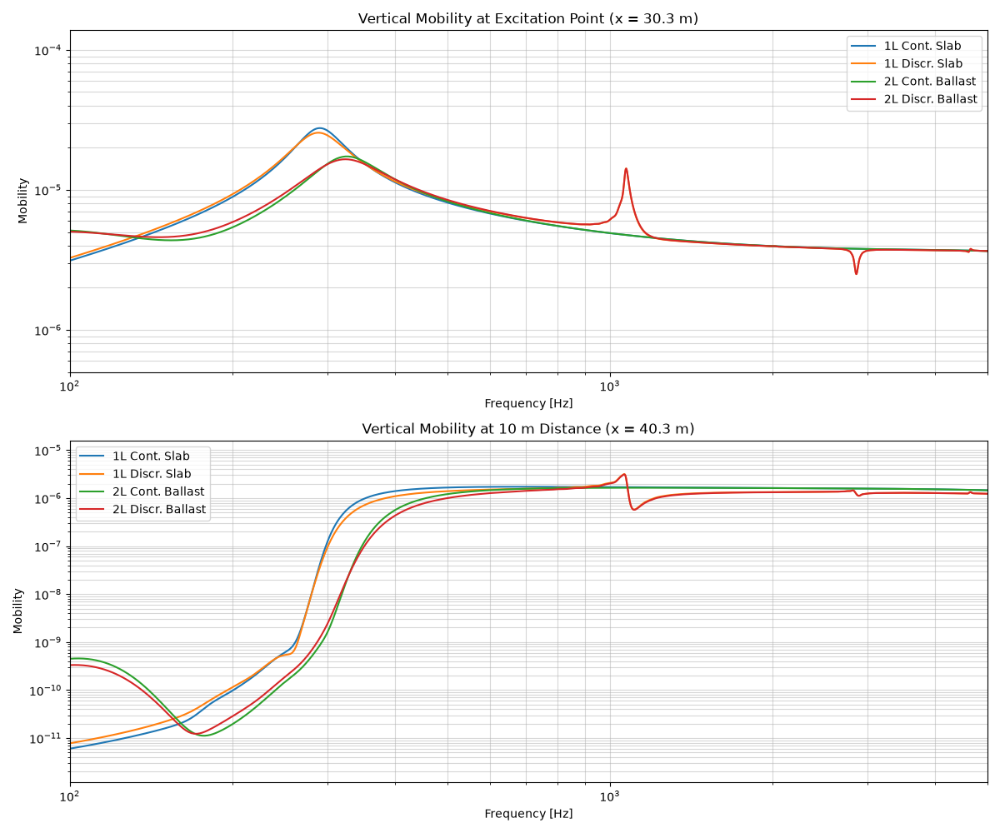

.. _different_tracks_vertical:

Compare Different Tracks (Vertical Excitation)
==============================================
This example demonstrates how to set up and run a basic simulation using the Rolland library to calculate the
vertical frequency response of different railway tracks. The example includes continuous and discrete tracks
with a single or double layer. See :cite:`thompson2024j` for more information.

.. code-block:: python
  :caption: Python Code
  :linenos:

    """
    Comparative Track Vibration Analysis using Rolland API

    This example demonstrates a comparison of vibration characteristics for:
        1. Continuous slab track (1-layer cont.)
        2. Discrete slab track (1-layer discr.)
        3. Continuous ballasted track (2-layer cont.)
        4. Discrete ballasted track (2-layer discr.)
    """

    from matplotlib import pyplot as plt
    from rolland import DiscrPad, Sleeper, Ballast, ContPad, Slab
    from rolland.database.rail.db_rail import UIC60
    from rolland import (
        ContSlabSingleRailTrack,
        ContBallastedSingleRailTrack,
        SimplePeriodicSlabSingleRailTrack,
        SimplePeriodicBallastedSingleRailTrack,
    )
    from rolland import CFSPML
    from rolland import GaussianImpulse
    from rolland import Deflection
    from rolland import DomSetup
    from rolland.postprocessing import TrackResponse

    # 1. PARAMETERS DEFINITION -----------------------------------------------------
    slep_dist = 0.6
    rail = UIC60

    contpad = ContPad(
        # Stiffness [N/m^2]
        sp_z=120e6 / slep_dist,
        sp_y=40e6 / slep_dist,
        sp_x=40e6 / slep_dist,
        
        # Damping loss factors [-]
        etap_z=0.2,
        etap_y=0.2,
        etap_x=0.2,
        etap_r=0.2,
        
        # Geometry [m]
        wdthp=0.15,
    )

    discrpad = DiscrPad(
        # Stiffness [N/m]
        sp_z=120e6,
        sp_y=40e6,
        sp_x=40e6,
        
        # Damping loss factors [-]
        etap_z=0.2,
        etap_y=0.2,
        etap_x=0.2,
        etap_r=0.2,
        
        # Geometry [m]
        wdthp=0.15,
    )

    sleeper = Sleeper(
        # Mass [kg] and Density [kg/m^3]
        ms=300.05,
        rhos=2648,
        
        # Inertia [kg*m^2]
        Is_x=0.0593,
        Is_y=0.00089,
        Is_z=0.0596,
        
        # Geometry [m]
        lengs=2.5,
        wdths=0.245,
        heights=0.185,
        z_st=-0.0925,
        z_sb=0.0925,
    )

    slab = Slab(
        # Mass per unit length [kg/m]
        ms=300.05 / slep_dist,
        
        # Inertia per unit length [kg*m^2/m]
        Is_x=0.0593 / slep_dist,
        Is_y=0.00089 / slep_dist,
        Is_z=0.0596 / slep_dist,
        
        # Density [kg/m^3]
        rhos=2648,
        
        # Geometry [m]
        lengs=2.5,
        equ_wdths=0.245,
        heights=0.185,
        z_st=-0.0925,
        z_sb=0.0925,
    )

    contballast = Ballast(
        # Stiffness [N/m^2]
        sb_z=120e6 / slep_dist,
        sb_y=120e6 / slep_dist,
        sb_x=120e6 / slep_dist,
        
        # Damping loss factors [-]
        etab_z=1.0,
        etab_y=2.0,
        etab_x=2.0,
        etab_r=2.0,
    )

    discrballast = Ballast(
        # Stiffness [N/m]
        sb_z=120e6,
        sb_y=120e6,
        sb_x=120e6,
        
        # Damping loss factors [-]
        etab_z=1.0,
        etab_y=2.0,
        etab_x=2.0,
        etab_r=2.0,
    )

    # 2. TRACK DEFINITIONS ---------------------------------------------------------
    # 2.1 Continuous slab track
    track_1l_cont = ContSlabSingleRailTrack(
        rail=rail, pad=contpad, l_track=60, z_f=81e-3, y_f=0
    )

    # 2.2 Discrete slab track
    track_1l_discr = SimplePeriodicSlabSingleRailTrack(
        rail=rail, pad=discrpad, z_f=81e-3, y_f=0, num_mount=100
    )

    # 2.3 Continuous ballasted track
    track_2l_cont = ContBallastedSingleRailTrack(
        rail=rail, slab=slab, ballast=contballast, pad=contpad, l_track=60, z_f=81e-3, y_f=0
    )

    # 2.4 Discrete ballasted track
    track_2l_discr = SimplePeriodicBallastedSingleRailTrack(
        rail=rail, pad=discrpad, sleeper=sleeper, ballast=discrballast, z_f=81e-3, y_f=0, num_mount=100
    )

    # 3. BOUNDARY & EXCITATION ----------------------------------------------------
    bound = CFSPML()
    exc_vert = GaussianImpulse(x_excit=30.3)

    # 4. SIMULATION & POSTPROCESSING -----------------------------------------------
    tracks = [
        ("1L Cont. Slab", track_1l_cont),
        ("1L Discr. Slab", track_1l_discr),
        ("2L Cont. Ballast", track_2l_cont),
        ("2L Discr. Ballast", track_2l_discr),
    ]

    fig, (ax1, ax2) = plt.subplots(2, 1, figsize=(12, 10))

    for label, trk in tracks:
        # 4.1 Set up simulation domain and discretization
        discr = DomSetup(track=trk, bound=bound, req_simt=0.5)
        
        # 4.2 Run the deflection simulation for excitation point
        defl_excit = Deflection(discr=discr, excit=exc_vert, store="excit")
        
        # 4.3 Compute frequency response and plot on ax1
        response_excit = TrackResponse(result=defl_excit)
        response_excit.show(ax=ax1, label=label)
        
        # 4.4 Run the deflection simulation observing at 10m distance
        defl_obs = Deflection(discr=discr, excit=exc_vert, store="observe", obs_pos=40.3)
        
        # 4.5 Compute frequency response and plot on ax2
        response_obs = TrackResponse(result=defl_obs)
        response_obs.show(ax=ax2, label=label)

    ax1.set_title("Vertical Mobility at Excitation Point (x = 30.3 m)")
    ax2.set_title("Vertical Mobility at 10 m Distance (x = 40.3 m)")

    plt.tight_layout()
    plt.show()

