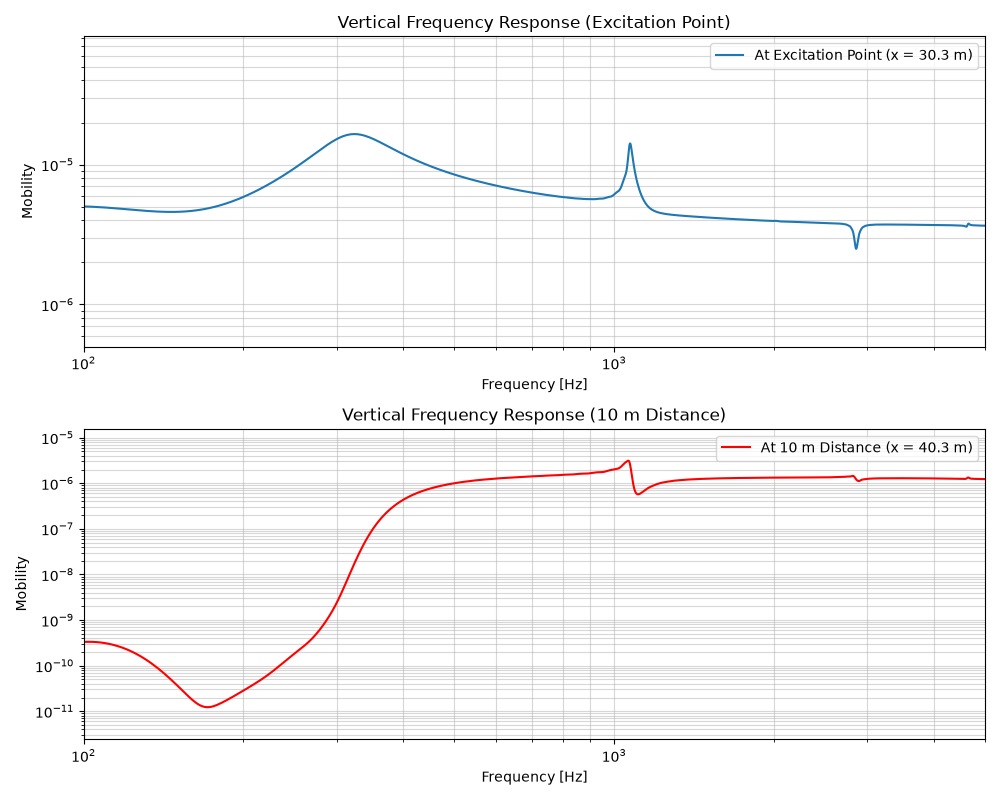

.. _quick_start:

First Simulation
================

This example determines the track response of a double layer track with discrete mounting positions.
The track is excited between two sleepers by a Gaussian impulse.

.. code-block:: python
  :caption: Python Code
  :linenos:

    """
    Example: Track Vibration Analysis using Rolland API

    This example demonstrates how to:
        1. Create a railway track model
        2. Apply excitation and boundary conditions
        3. Run a vibration simulation
        4. Analyze and plot mobility results
    """

    from matplotlib import pyplot as plt
    from rolland import DiscrPad, Sleeper, Ballast
    from rolland.database.rail.db_rail import UIC60
    from rolland.track import SimplePeriodicBallastedSingleRailTrack
    from rolland.boundary import CFSPML
    from rolland.excitation import GaussianImpulse
    from rolland.deflection import Deflection
    from rolland.domainsetup import DomSetup
    from rolland.postprocessing import TrackResponse

    # 1. PARAMETERS DEFINITION -----------------------------------------------------
    pad = DiscrPad(
        # Stiffness [N/m]
        sp_z=120e6,
        sp_y=40e6,
        sp_x=40e6,
        
        # Damping loss factors [-]
        etap_z=0.2,
        etap_y=0.2,
        etap_x=0.2,
        etap_r=0.2,
        
        # Geometry [m]
        wdthp=0.15,
    )

    sleeper = Sleeper(
        # Mass [kg] and Density [kg/m^3]
        ms=300.05,
        rhos=2648,
        
        # Inertia [kg*m^2]
        Is_x=0.0593,
        Is_y=0.00089,
        Is_z=0.0596,
        
        # Geometry [m]
        lengs=2.5,
        wdths=0.245,
        heights=0.185,
        z_st=-0.0925,
        z_sb=0.0925,
    )

    ballast = Ballast(
        # Stiffness [N/m]
        sb_z=120e6,
        sb_y=120e6,
        sb_x=120e6,
        
        # Damping loss factors [-]
        etab_z=1.0,
        etab_y=2.0,
        etab_x=2.0,
        etab_r=2.0,
    )

    # 2. TRACK DEFINITIONS ---------------------------------------------------------
    track = SimplePeriodicBallastedSingleRailTrack(
        rail=UIC60,
        pad=pad,
        sleeper=sleeper,
        ballast=ballast,
        z_f=81e-3,
        y_f=0,
        num_mount=100,
    )

    # 3. BOUNDARY & EXCITATION ----------------------------------------------------
    bound = CFSPML()
    exc_vert = GaussianImpulse(x_excit=30.3)

    # 4. SIMULATION & POSTPROCESSING -----------------------------------------------
    discr = DomSetup(
        track=track,
        bound=bound,
        req_simt=0.5,
    )

    # 4.1 Deflection at excitation point
    defl_excit = Deflection(
        discr=discr,
        excit=exc_vert,
        store="excit",
    )

    # 4.2 Deflection at 10 m distance (30.3 + 10 = 40.3 m)
    defl_dist = Deflection(
        discr=discr,
        excit=exc_vert,
        store="observe",
        obs_pos=40.3,
    )

    # 4.3 Compute frequency responses and plot
    resp_defl_excit = TrackResponse(result=defl_excit)
    resp_defl_dist = TrackResponse(result=defl_dist)

    fig, (ax1, ax2) = plt.subplots(2, 1, figsize=(10, 8))

    # Plot response at excitation point
    resp_defl_excit.show(ax=ax1, label="At Excitation Point (x = 30.3 m)")
    ax1.set_title("Vertical Frequency Response (Excitation Point)")

    # Plot response at 10 m distance
    resp_defl_dist.show(ax=ax2, label="At 10 m Distance (x = 40.3 m)", color="r")
    ax2.set_title("Vertical Frequency Response (10 m Distance)")

    plt.tight_layout()
    plt.show()

