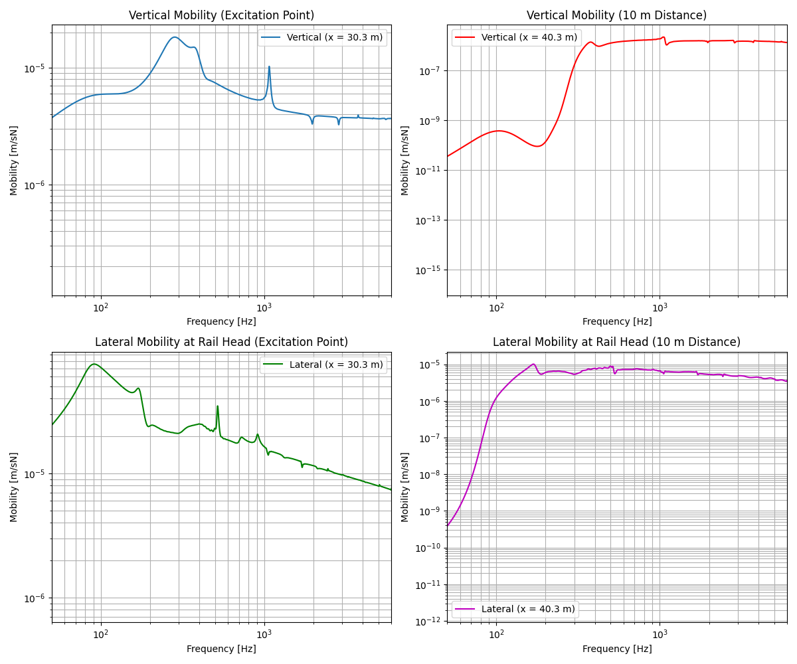

.. _variation:

Structural Irregularity
=======================
Structural irregularity in railway tracks (such as non-uniform sleeper spacing or varying rail pad properties)
can significantly affect track vibration characteristics (see :cite:t:`mantel2024`).
This example demonstrates how to set up and run a simulation using the Rolland library to calculate the vertical
and lateral frequency responses of a track model with structural irregularity.

.. note:: This example calculates the vertical and lateral track response at a single excitation position and at 10 m distance.
            For tracks with structural irregularity, it is recommended to evaluate responses at multiple positions for a comprehensive representation.

.. code-block:: python
  :caption: Python Code
  :linenos:

    """
    Track Vibration Analysis with Custom Support Arrangement using Rolland API

    This example demonstrates how to set up and analyze a ballasted track with
    periodic support arrangements (alternating sleeper distances and pad stiffnesses).
    """

    from matplotlib import pyplot as plt
    from rolland import DiscrPad, Sleeper, Ballast
    from rolland.database.rail.db_rail import UIC60
    from rolland.track import ArrangedBallastedSingleRailTrack
    from rolland.arrangement import PeriodicArrangement
    from rolland.boundary import CFSPML
    from rolland.excitation import GaussianImpulse
    from rolland.deflection import Deflection
    from rolland.domainsetup import DomSetup
    from rolland.postprocessing import DEVITO_PP

    # 1. TRACK & ARRANGEMENT DEFINITION -------------------------------------------
    rail = UIC60

    pad_A = DiscrPad(
        sp_z=120e6, sp_y=40e6, sp_x=40e6,
        etap_z=0.2, etap_y=0.2, etap_x=0.2, etap_r=0.2, wdthp=0.15
    )

    pad_B = DiscrPad(
        sp_z=60e6, sp_y=20e6, sp_x=20e6,
        etap_z=0.2, etap_y=0.2, etap_x=0.2, etap_r=0.2, wdthp=0.15
    )

    sleeper = Sleeper(
        ms=300.05, rhos=2648, Is_x=0.0593, Is_y=0.00089, Is_z=0.0596,
        lengs=2.5, wdths=0.245, heights=0.185, z_st=-0.0925, z_sb=0.0925
    )

    ballast = Ballast(
        sb_z=120e6, sb_y=120e6, sb_x=120e6,
        etab_z=1.0, etab_y=2.0, etab_x=2.0, etab_r=2.0
    )

    track = ArrangedBallastedSingleRailTrack(
        rail=rail,
        pad=PeriodicArrangement(item=[pad_A, pad_B]),
        sleeper=PeriodicArrangement(item=[sleeper]),
        ballast=PeriodicArrangement(item=[ballast]),
        distance=PeriodicArrangement(item=[0.7, 0.5]),
        z_f=81e-3,
        y_f=0,
        num_mount=100,
    )

    # 2. BOUNDARY & EXCITATIONS ---------------------------------------------------
    bound = CFSPML()
    exc_vert = GaussianImpulse(x_excit=30.3)
    exc_lat = GaussianImpulse(x_excit=30.3, force_dir="lateral", z_e=-71e-3)

    # 3. DISCRETIZATION & SIMULATION ----------------------------------------------
    discr = DomSetup(
        track=track,
        bound=bound,
        req_simt=0.5,
    )

    # Vertical deflection simulations
    defl_vert_excit = Deflection(discr=discr, excit=exc_vert, store="excit")
    defl_vert_dist = Deflection(discr=discr, excit=exc_vert, store="observe", obs_pos=40.3)

    # Lateral deflection simulations
    defl_lat_excit = Deflection(discr=discr, excit=exc_lat, store="excit")
    defl_lat_dist = Deflection(discr=discr, excit=exc_lat, store="observe", obs_pos=40.3)

    # 4. POSTPROCESSING & VISUALIZATION -------------------------------------------
    freq, mob_z_excit = DEVITO_PP.calculate_mobility(defl_vert_excit.u_z_obs, exc_vert.force, discr)
    _, mob_z_dist = DEVITO_PP.calculate_mobility(defl_vert_dist.u_z_obs, exc_vert.force, discr)

    _, mob_y_excit = DEVITO_PP.calc_coupled_mobility(
        defl_lat_excit.u_y_obs, defl_lat_excit.phi_x_obs, exc_lat.z_e, exc_lat.force, discr
    )
    _, mob_y_dist = DEVITO_PP.calc_coupled_mobility(
        defl_lat_dist.u_y_obs, defl_lat_dist.phi_x_obs, exc_lat.z_e, exc_lat.force, discr
    )

    plt.figure(figsize=(12, 10))

    # Subplot 1: Vertical Mobility at Excitation Point
    plt.subplot(2, 2, 1)
    plt.loglog(freq[:discr.nt // 2], abs(mob_z_excit[:discr.nt // 2]), label="Vertical (x = 30.3 m)")
    plt.xlabel("Frequency [Hz]")
    plt.ylabel("Mobility [m/sN]")
    plt.title("Vertical Mobility (Excitation Point)")
    plt.xlim(50, 6000)
    plt.grid(True, which="both")
    plt.legend()

    # Subplot 2: Vertical Mobility at 10 m Distance
    plt.subplot(2, 2, 2)
    plt.loglog(freq[:discr.nt // 2], abs(mob_z_dist[:discr.nt // 2]), "r", label="Vertical (x = 40.3 m)")
    plt.xlabel("Frequency [Hz]")
    plt.ylabel("Mobility [m/sN]")
    plt.title("Vertical Mobility (10 m Distance)")
    plt.xlim(50, 6000)
    plt.grid(True, which="both")
    plt.legend()

    # Subplot 3: Lateral Mobility at Excitation Point
    plt.subplot(2, 2, 3)
    plt.loglog(freq[:discr.nt // 2], abs(mob_y_excit[:discr.nt // 2]), "g", label="Lateral (x = 30.3 m)")
    plt.xlabel("Frequency [Hz]")
    plt.ylabel("Mobility [m/sN]")
    plt.title("Lateral Mobility at Rail Head (Excitation Point)")
    plt.xlim(50, 6000)
    plt.grid(True, which="both")
    plt.legend()

    # Subplot 4: Lateral Mobility at 10 m Distance
    plt.subplot(2, 2, 4)
    plt.loglog(freq[:discr.nt // 2], abs(mob_y_dist[:discr.nt // 2]), "m", label="Lateral (x = 40.3 m)")
    plt.xlabel("Frequency [Hz]")
    plt.ylabel("Mobility [m/sN]")
    plt.title("Lateral Mobility at Rail Head (10 m Distance)")
    plt.xlim(50, 6000)
    plt.grid(True, which="both")
    plt.legend()

    plt.tight_layout()
    plt.show()

