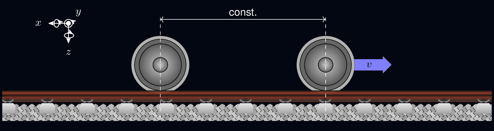

Rolland
========================

.. note:: This repository is still under development!

.. image:: images/mwi_light.png
   :alt: MWI Image
   :width: 700px
   :class: light-mode-image

Rolling Noise and Dynamics (**Rolland**) is an open-source, high-performance time-domain simulation framework designed to analyze, predict, and optimize the dynamic and acoustic properties of railway tracks.

By employing an explicit Finite Difference Method (FDM) scheme, **Rolland** solves 27 coupled differential equations to capture full 3D track dynamics—including coupled vertical bending, lateral bending, axial torsion, cross-sectional warping, and sleeper movement under eccentric excitation and support conditions. The framework incorporates Complex Frequency-Shifted Perfectly Matched Layers (CFS-PML) for infinite track modeling and supports spatially varying track properties as well as moving excitation sources.

Key Features
------------

Current Features
~~~~~~~~~~~~~~~~

* **Full Track Dynamics:** Solves 27 coupled differential equations to capture vertical, lateral, torsional, and warping rail behavior together with sleeper movement and eccentric support reactions.
* **Fast Time-Domain Solver:** Uses explicit Finite Difference Method (FDM) schemes with high-order stencils for fast simulations (~7s compute time for 0.5s simulation).
* **Infinite Track Boundary (CFS-PML):** Uses absorbing boundary layers to eliminate artificial wave reflections.
* **Flexible Track Structures:** Supports ballasted and slab tracks with continuous or discrete supports, including spatial (periodic or stochastic) track property variations.
* **Excitation:** Includes stationary excitation (Gaussian impulse) and moving sources (e.g. moving random force).
* **Post-Processing & Validation:** Computes point/transfer mobility, Track Decay Rate (TDR), and provides built-in reference models for easy validation.

Planned Features
~~~~~~~~~~~~~~~~

* Non-linear Hertzian contact dynamics for wheel-rail interaction.
* Multi-wheel vehicle pass-by excitation models.
* Rail acoustic radiation modeling.

Citation
--------

If you use **Rolland** in your research, please cite the following paper:

.. code-block::

   @inproceedings{mantel2026rolland,
     title     = {Rolland: A New Framework for Realistic and Computationally Efficient Rolling Noise Modeling in the Time Domain},
     author    = {Mantel, Maximilian and Sarradj, Ennes},
     booktitle = {Proceedings of Forum Acusticum 2026},
     year      = {2026}
   }

.. toctree::
   :hidden:
   :maxdepth: 2
   
   Installation <install/index>
   User Guide <user_guide/index>
   API Reference <api_ref/index>
   Examples <examples/index>
   What's New <whats_new/index>
   License <license/index>
   Literature <literature/index>